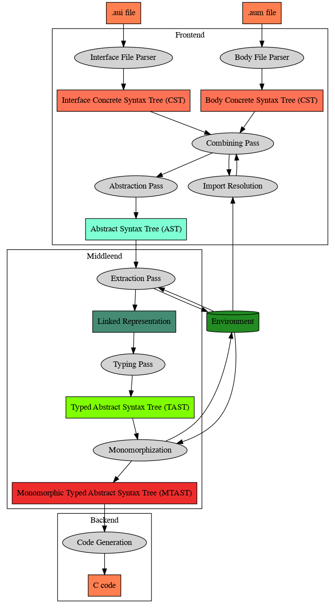

# How the Austral Compiler Works

This document is a walkthrough of every stage in the Austral bootstrapping
compiler's pipeline, from source to target.

# Overview

The overall pipeline looks like this:



# Parsing

Every Austral module is divided into two files: the module interface file and
the module body file.

Each one is parsed into a separate **CST** (concrete syntax tree) by the
functions in the `ParserInterface` module.

# Import Insertion Pass

Each of the module interface and module body are modified to have an implicit
import of all the symbols in the `Austral.Pervasive` module.

# Combining Pass

The combining pass takes the CST for the module interface and for the module
body and combines them into a single representation, where all declarations are
present and have visibility information derived from whether or not they appear
in the module interface.

# Extraction Pass

The extraction pass goes through a combined module and extracts its declarations
into the environment. The bodies of functions and methods are ignored.

# Typing Pass

The typing pass is the largest pass by volume: type checking happens here, and
the untyped AST is converted into a **TAST** (typed abstract syntax tree).

# Linearity Checking

This section describes Austral's **linearity checker**. The linearity checker
works a lot like abstract interpretation: we traverse the code in execution
order, keeping track of different things in a state table to implement the
linearity and borrowing rules.

The linearity checker starts with a function or method to check. Then it
traverses the code in depth-first order, essentially the order of control
flow. Throughout the traversal we keep track of two things:

1. The **loop depth**.

2. The **state table**.

The loop depth is: at this point in the code, how many loops are we in? This is
used to enforce the rule that a linear variable cannot be consumed inside a
loop, when said variable was defined outside that loop (because the variable
could be consumed multiple times).

For example:

```
let x: T := Make_T();
while ... do
    let y: U := Make_U();
    for i from 0 to n do
        while ... do
            consume_y(y);
        end while;
    end for;
end while;
consume_t(x);
```

Here, `x` is defined and consumed at a loop deoth of 0, `y` is defined at a loop
depth of 1 and consumed at a loop depth of 3.

The state table associates linear variables to two things:

1. The loop depth where that variable is defined.

2. The current **consumption state** of the variable, which is one of
   `{Unconsumed, BorrowedRead, BorrowedWrite, Consumed}`.

This is how it works:

**The Linearity Checking Algorithm:** Given a function or method definition:

1. Initialize `loopDepth` to 0 and `state` to the empty state table.

2. Iterate over every parameter `p` of a linear type:

    1. Add an entry `(name = p, depth = 0, state = Unconsumed)` to the state
       table.

3. Traverse the code in depth-first order:

    1. When entering a `for` or `while` loop body, increase `loopDepth` by one.

    2. Dually, when leaving a loop body, decrease `loopDepth` by one.

    3. When encountering a `let` statement defining a variable `x` of a linear type:

        1. Add an entry `(name = x, depth = depth, state = Unconsumed)` to the
           state table.

    4. When encountering an expression, for each variable `x` in the state
       table:

       1. Count the number of times `x` is consumed in the expression and call
          it `W` (e.g., for `f(x, g(x))` it's twice).

       2. Count the number of times `x` appears in a read-only anonymous borrow
          (`&`) and a read-write anonymous borrow (`&!`) and call them `R` and
          `W`, respectively (e.g., in `f(&x, &x, &!x)` then `R` is two and `W`
          is one).

       3. Count the number of times `x` appears at the head of a path and call it
         `P` (e.g., `x.foo` counts as once).

       4. Then:

           1. If `C > 1`, signal an error, because `x` is being consumed more than once.

           2. If `C = 1`, check in the table that `x` is `Unconsumed`, and that
              `R`, `W`, and `P` are zero (i.e.: we're not reading or borrowing
              in the same expression where we're consuming), and that the loop
              depth where `x` was defined is the same as the current value of
              `loopDepth`. Mark `x` as consumed and move on.

           3. If `C = 0`:

               1. If `W > 1`: signal an error (we can't borrow mutably multiple
                  times in the same expression).

               2. If `W = 1`, check in the table that `x` is `Unconsumed`, and
                  check that `R` and `P` are zero (i.e., we can't borrow mutably
                  and also read within the same expression).

               3. If `W = 0`, either `R` and `P` can be non-zero (i.e., we can
                  read freely) iff `x` is `Unconsumed`.

    5. When encountering a `borrow` statement for a variable `x`, check that `x`
       is `Unconsumed`. Mark `x` as `BorrowedRead` or `BorrowedWrite` for the
       duration of the statement's body.

    6. When encountering a `return` statement, ensure that all variables in the
       state table are consumed. Otherwise, signal an error.

# Body Extraction Pass

In the body extraction pass, the bodies of functions and instance methods are
extracted from a typed module instance and stored in the environment. We need
the bodies in the environment to instantiate generic functions in the
monomorphization pass.

# Monomorphization Pass

In the monomorphization pass, generic types and functions are instantiated into
concrete types.

# Code Generation

In the code generation pass, a monomorphized module is converted into a C
translation unit.

# Rendering

In the rendering pass, implemented in the `CRender` module, the C code AST is
rendered into C code which is dumped to a file for GCC/Clang to compile.
